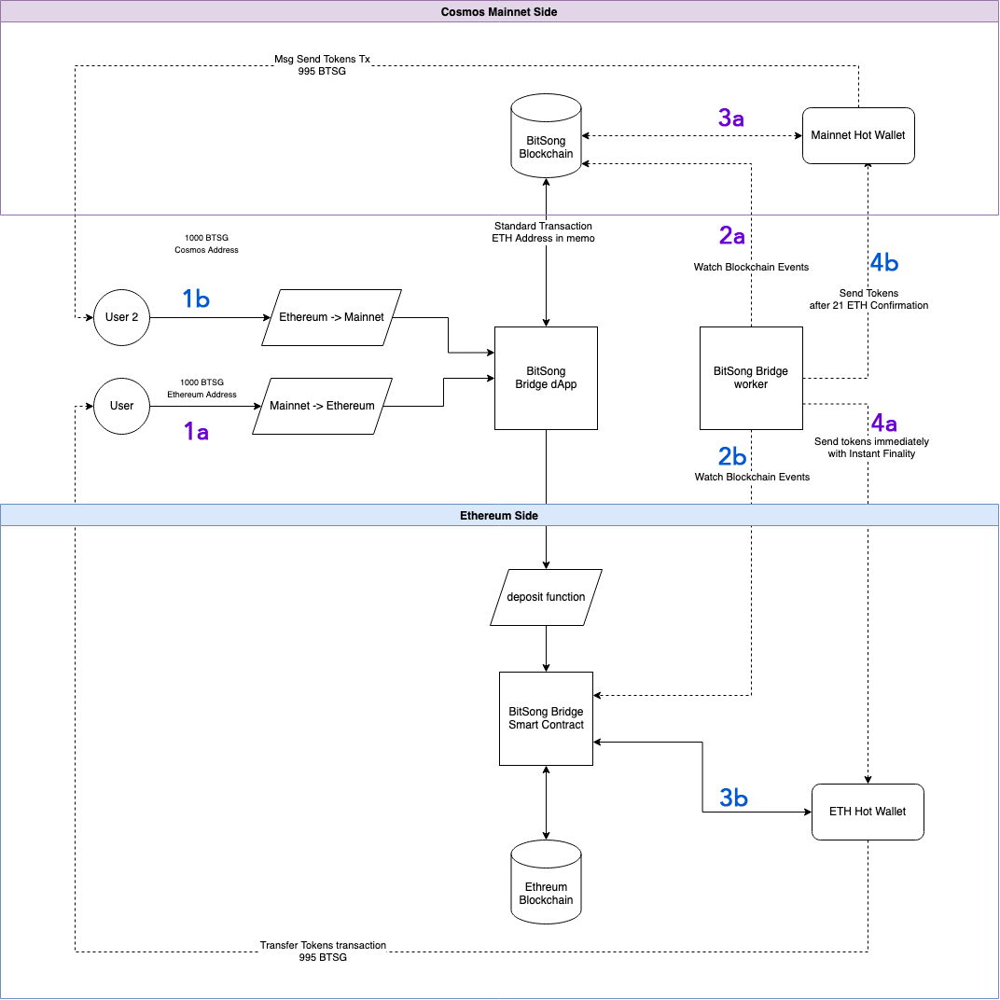
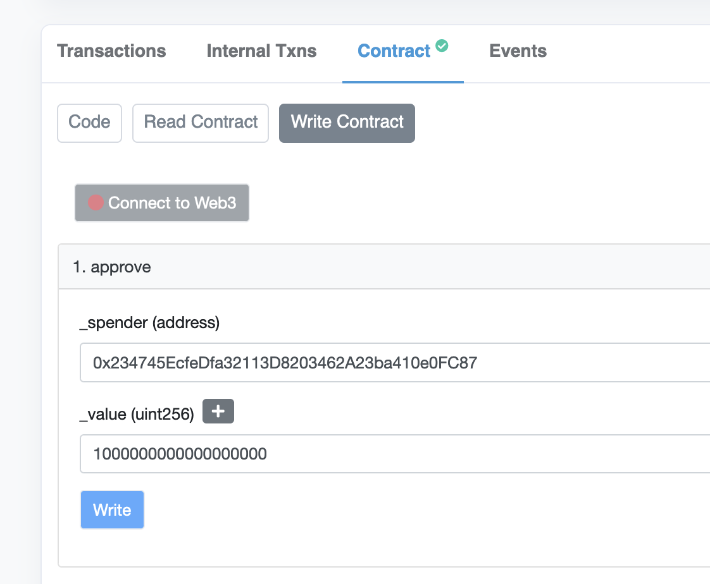
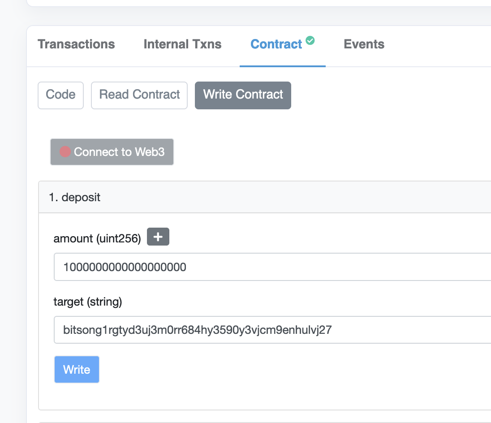

# Cassini | BitSong Ethereum<->Mainnet Bridge

This bridge allows transfer of ERC20 BTSG to Cosmos Mainnet and vice-versa

# Components

- [Ethereum Smart Contract](./contracts/BitsongBridge.sol)
- [Ethereum Side](./src/libraries/ethereum.ts)
- [Mainnet Side](./src/libraries/cosmos.ts)

# Usage

**Requirements**

1. NodeJS 14
1. npm or yarn
1. MySQL 5.7 or Docker

**Install node modules**

```shell
npm install
```

**Run MySQL**

The bridge requires a MySQL database where save the status of transactions, as well as nonce and other sync parameters. You can use your self installed database, or run it trough Docker with the following command.

```
docker-compose up -d
```

**TODO:** Move MySQL configuration to .env file, right now is using TypeORM default values.

**Run the bridge (dev mode)**

```shell
npm run start
```

The bridge will now be active, looking for onchain events on one side and sending transactions on the other side.

## Configuration

Copy `.env.example` file to `.env` and personalize to your needs

| param                            | description                                                          |
| -------------------------------- | -------------------------------------------------------------------- |
| ETHEREUM_SEND_INTERVAL           | Interval at which transactions are broacasted on Ethereum Side       |
| COSMOS_SEND_INTERVAL             | Interval at which transactions are broacasted on Mainnet Cosmos Side |
| COSMOS_MAINNET_API               | LCD Api of Cosmos Side (https://lcd-bitsong.itastakers.com)          |
| COSMOS_BRIDGE_ADDRESS            | Cosmos hot wallet, with liquidity and bridge transactions            |
| COSMOS_MNEMONIC                  | Private key of cosmos hot wallet                                     |
| COSMOS_GAS_PRICE                 | Default gas price cosmos side                                        |
| COSMOS_DENOM                     | Cosmos minimal denom                                                 |
| COSMOS_START_HEIGHT              | Start height at which look for transfer logs                         |
| ETH_API                          | Ethereum JSON RPC API URL (infura or similar)                        |
| ETHEREUM_MNEMONIC                | Ethereum bridge hot wallet private key                               |
| ETHEREUM_TOKEN_CONTRACT_ADDRESS  | Ethereum BTSG Token Contract Address                                 |
| ETHEREUM_BRIDGE_CONTRACT_ADDRESS | Ethereum Deposit/Bridge Contract Address                             |
| ETHEREUM_LOG_TOPICS              | Topic to look for in Ethereum transaction Logs                       |
| ETHEREUM_START_HEIGHT            | Start height at which look for `hasBeenAddedd` logs                  |
| ETHEREUM_CONFIRMATIONS           | Min number of confirmation before relay from ETH to Cosmos           |
| BRIDGE_MIN_FEE                   | Mimimum fee for relay in BTSG                                        |
| BRIDGE_FEE_PERCENT               | Fee % for tx relay (default 0.5%)                                    |

# Schema



### Mainnet -> Ethereum

- 1a) User send a standard transaction on Cosmos Side to the Bridge hot wallet, inserting his Ethereum address in the memo field
- 2a) Bridge worker look for transfer events onchain
- 3a) Tokens arrive in mainnet hot wallet, and are liquid in the bridge
- 4a) With instant finality we can immediately send tokens on Ethereum side, from the hot wallet.

### Ethereum -> Mainnet

- 1b) User send a deposit() transaction to the `BitsongBridge` smart contract address, specifying amount of tokens and the recepient Cosmos `btsg1` address
- 2b) Bridge worker lookf for `hasBeenAddedd` logs from the smart contract
- 3b) Smart contract transfer the tokens to Ethereum hot wallet
- 4b) After 21 confirmations, a standard send transaction is generated and broadcasted on mainnet side from the hot wallet to the recepient.

# Token bridge test

The bridge is currently deployed on `Ropsten` ETH Netowrk and `bitsong-bridge-1` Bitsong testnet.

**Cosmos Bridge Wallet Address**
`bitsong14ayssdzwd6tdspcnn6zyhfwvlh6cv93cxtd0fz`

**Ethereum Bridge Wallet Address**
`0x8Ff25a5954E42B7f990C523C0e25c0e5dEDfC326`

**Ethereum Bridge Smart Contract Address**
`0x234745EcfeDfa32113D8203462A23ba410e0FC87`

**Ethereum Token Contract Address**
`0x4d439d3a5bad256433461b80a06c4ab452734a4a`

**Min amount accepted by the relayer to transfer**
`10 BTTT`

## Test transfer from Cosmos to Ethereum

1. Install bitsongcli binary at version [v0.7.1](https://github.com/bitsongofficial/go-bitsong/releases/tag/v0.7.1)
  - `wget https://github.com/bitsongofficial/go-bitsong/releases/download/v0.7.1/bitsongcli`
  - `chmod +x bitsongcli`
  - `./bitsongcli version`  
3. Transfer the tokens you want to bridge with the recepient ethereum address in the memo field of the transaction:
4. `bitsongcli tx send {from} bitsong14ayssdzwd6tdspcnn6zyhfwvlh6cv93cxtd0fz 10000000000ubtsg --memo "0x{your eth address}" --node tcp://bridge-test.bitsong.network:26657 --chain-id bitsong-bridge-1` **Unit**: 1BTTT = 1000000ubtsg
5. You will receive tokens after a few minutes on Ethereum. Depending on network congestion

## Test transfer from Ethereum to Cosmos

1. Approve the bridge contract as spender of your BTTT tokens. This can be done on Etherscan with MetaMask, visiting https://ropsten.etherscan.io/address/0x4d439d3a5bad256433461b80a06c4ab452734a4a#writeContract and choosing "approve"



**_spender** must be set to the Bridge Contract address `0x234745EcfeDfa32113D8203462A23ba410e0FC87`

**_value** must be greater than the amount you want to transfer, in wei. you can use https://eth-converter.com/ to convert. For example, if you want to transfer 10 BTTT, you must set it greater than `10000000000000000000000000`


2. Transfer BTTT tokens to the bridge contract using the "deposit" function. This can be don on Etherscan with MetaMask: https://ropsten.etherscan.io/address/0x234745EcfeDfa32113D8203462A23ba410e0FC87#writeContract. Set as target the mainnet address that should receive your tokens



**amount** is the amount of tokens you want to transfer, in wei unit.
**target** is the bitsong address that will receive the tokens.


3. After 12 confirmations on Ethereum network tokens will be transfered to your mainnet address.
