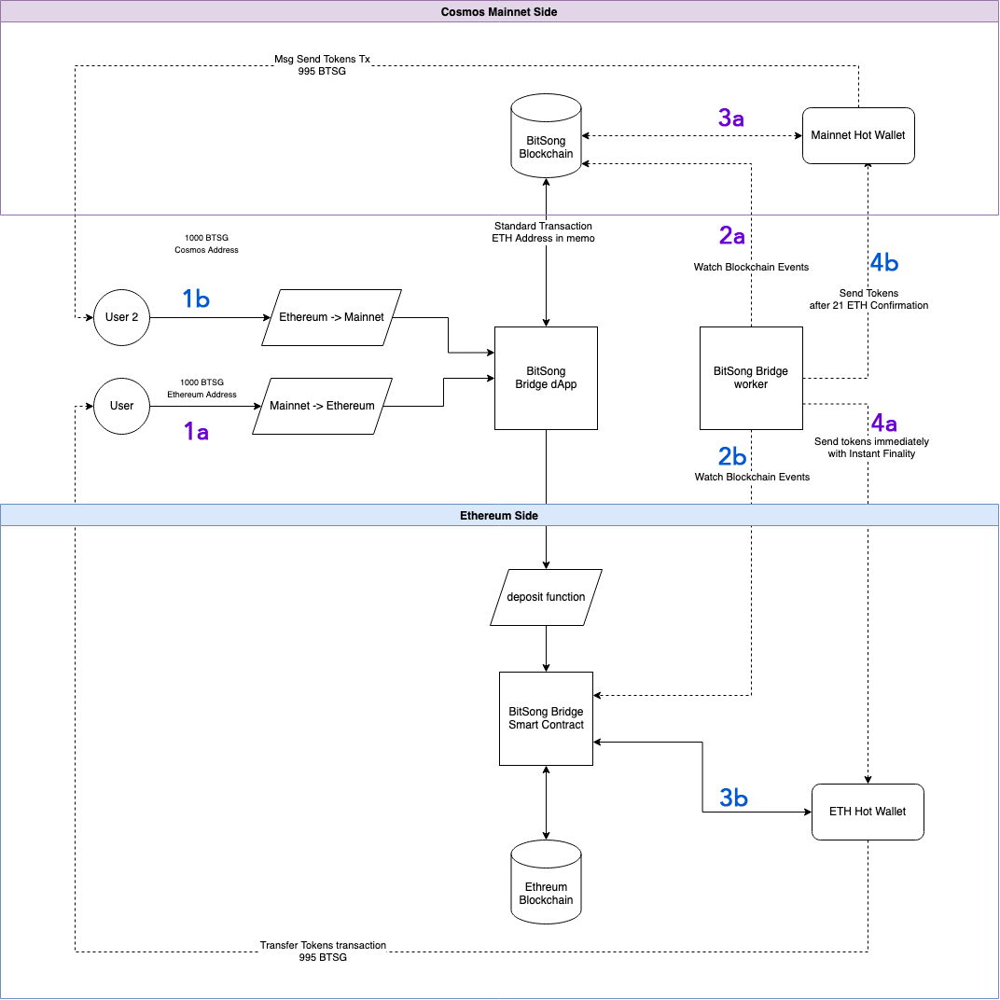

# Cassini | BitSong Ethereum<->Mainnet Bridge 

This bridge allows transfer of ERC20 BTSG to Cosmos Mainnet and vice-versa

# Components

- [Ethereum Smart Contract](./contracts/BitsongBridge.sol)
- [Ethereum Side](./src/libraries/ethereum.ts)
- [Mainnet Side](./src/libraries/cosmos.ts)

# Usage

**Requirements** 

1. NodeJS 14
1. npm or yarn
1. MySQL 5.7 or Docker

**Install node modules**

```shell
npm install
```

**Run MySQL**

The bridge requires a MySQL database where save the status of transactions, as well as nonce and other sync parameters. You can use your self installed database, or run it trough Docker with the following command.

```
docker-compose up -d
```

**TODO:** Move MySQL configuration to .env file, right now is using TypeORM default values.


**Run the bridge (dev mode)**
```shell
npm run start
```

The bridge will now be active, looking for onchain events on one side and sending transactions on the other side.

## Configuration
Copy `.env.example` file to `.env` and personalize to your needs


| param | description |
|-------|--------|
|ETHEREUM_SEND_INTERVAL| Interval at which transactions are broacasted on Ethereum Side|
|COSMOS_SEND_INTERVAL| Interval at which transactions are broacasted on Mainnet Cosmos Side|
|COSMOS_MAINNET_API| LCD Api of Cosmos Side (https://lcd-bitsong.itastakers.com)
|COSMOS_BRIDGE_ADDRESS| Cosmos hot wallet, with liquidity and bridge transactions|
|COSMOS_MNEMONIC| Private key of cosmos hot wallet|
|COSMOS_GAS_PRICE| Default gas price cosmos side|
|COSMOS_DENOM| Cosmos minimal denom|
|COSMOS_START_HEIGHT| Start height at which look for transfer logs |
| ETH_API| Ethereum JSON RPC API URL (infura or similar)|
|ETHEREUM_MNEMONIC| Ethereum bridge hot wallet private key|
|ETHEREUM_TOKEN_CONTRACT_ADDRESS| Ethereum BTSG Token Contract Address|
|ETHEREUM_BRIDGE_CONTRACT_ADDRESS| Ethereum Deposit/Bridge Contract Address|
|ETHEREUM_LOG_TOPICS| Topic to look for in Ethereum transaction Logs|
|ETHREUM_STARAT_HEIGHT| Start height at which look for `hasBeenAddedd` logs |
|BRIDGE_MIN_FEE|Mimimum fee for relay in BTSG|
|BRIDGE_FEE_PERCENT|Fee % for tx relay (default 0.5%)

# Schema


### Mainnet -> Ethereum 
* 1a) User send a standard transaction on Cosmos Side to the Bridge hot wallet, inserting his Ethereum address in the memo field
* 2a) Bridge worker look for transfer events onchain
* 3a) Tokens arrive in mainnet hot wallet, and are liquid in the bridge
* 4a) With instant finality we can immediately send tokens on Ethereum side, from the hot wallet.

### Ethereum -> Mainnet
* 1b) User send a deposit() transaction to the `BitsongBridge` smart contract address, specifying amount of tokens and the recepient Cosmos `btsg1` address
* 2b) Bridge worker lookf for `hasBeenAddedd` logs from the smart contract
* 3b) Smart contract transfer the tokens to Ethereum hot wallet
* 4b) After 21 confirmations, a standard send transaction is generated and broadcasted on mainnet side from the hot wallet to the recepient.